```mermaid
graph LR
    A[🎓 CS Undergraduate] --> B[📜 Scrum & Agile Certified]
    B --> C[🤖 AI-Powered PM Skills]
    C --> D[💼 PM Internship]
    D --> E[🧭 IT Project Manager]
    E --> F[🚀 Digital Product Leader]
    F --> G[🌍 Global Impact]

    style A fill:#000000,stroke:#00FFFF,color:#00FFFF,stroke-width:2px
    style B fill:#000000,stroke:#FF00FF,color:#FF00FF,stroke-width:2px
    style C fill:#000000,stroke:#00FFFF,color:#00FFFF,stroke-width:2px
    style D fill:#000000,stroke:#FF00FF,color:#FF00FF,stroke-width:2px
    style E fill:#000000,stroke:#00FFFF,color:#00FFFF,stroke-width:2px
    style F fill:#000000,stroke:#FF00FF,color:#FF00FF,stroke-width:2px
    style G fill:#000000,stroke:#00FFFF,color:#00FFFF,stroke-width:2px
```

<!-- ═══════════════════════════════════════════════════════════════════════════════
     ██████╗  █████╗ ████████╗██╗  ██╗██╗   ██╗███╗   ███╗
     ██╔══██╗██╔══██╗╚══██╔══╝██║  ██║██║   ██║████╗ ████║
     ██████╔╝███████║   ██║   ███████║██║   ██║██╔████╔██║
     ██╔═══╝ ██╔══██║   ██║   ██╔══██║██║   ██║██║╚██╔╝██║
     ██║     ██║  ██║   ██║   ██║  ██║╚██████╔╝██║ ╚═╝ ██║
     ╚═╝     ╚═╝  ╚═╝   ╚═╝   ╚═╝  ╚═╝ ╚═════╝ ╚═╝     ╚═╝
                    J A Y A S U N D A R A
     ═══════════════════════════════════════════════════════════════════════════════ -->

<div align="center">

<!-- ═══════════════════════ ANIMATED HERO HEADER (PURE BLACK & NEON CYAN) ═══════════════════════ -->


<!-- ═══════════════════════ ANIMATED TYPING BANNER (NEON CYAN) ═══════════════════════ -->

<a href="https://github.com/pathumjayasundara">
  
</a>

<br/><br/>

<!-- ═══════════════════════ LIVE BADGE MATRIX (DARK THEME) ═══════════════════════ -->

    

<br/><br/>

<!-- ═══════════════════════ SOCIAL CONNECT (DARK THEME) ═══════════════════════ -->

<a href="https://www.linkedin.com/in/pathum-jayasundara-66a636345" target="_blank">
  
</a> <a href="https://pathum04.github.io/pathumjayasundara/" target="_blank">
  
</a> <a href="https://github.com/pathumjayasundara" target="_blank">
  
</a> <a href="mailto:pathumjayasundara04@gmail.com">
  
</a>

<br/><br/>


</div>

<!-- ═══════════════════════════════════════════════════════════════════════════════
                                    ABOUT ME
     ═══════════════════════════════════════════════════════════════════════════════ -->


##   Who Am I?

```typescript
const pathum: Developer = {
  name: "Pathum Jayasundara",
  location: "Kurunegala, Sri Lanka 🇱🇰",
  role: "Computer Science Undergraduate (3rd Year)",
  university: "Sabaragamuwa University of Sri Lanka",
  degree: "BSc (Hons) Computer Science & Technology",

  careerGoal: "IT Project Manager / Digital Product Leader",

  passions: [
    "IT Project Management",
    "Agile & Scrum Methodologies",
    "Digital Product Development",
    "AI-Powered Project Management",
    "Generative AI & Prompt Engineering",
    "Computer Vision & Deep Learning",
  ],

  currentlyLearning: [
    "Advanced Agile Frameworks",
    "AI in Project Recovery",
    "Scalable Product Management",
  ],

  openTo: [
    "IT Project Management Internships",
    "Agile / Scrum Team Roles",
    "Digital Product Roles",
    "AI-Enhanced PM Positions",
  ],

  motto: "Bridge technology, people & business — deliver impactful solutions. 🌉",
};
```

<br/>

### 🎯 The Mission

> 🎓 A **3rd-year Computer Science undergraduate** at **Sabaragamuwa University of Sri Lanka**, deeply passionate about **IT Project Management, Agile & Scrum, and Digital Product Development**. My journey is driven by a simple goal: **to bridge technology, people, and business to deliver impactful digital solutions.**

<br clear="right"/>

---

<!-- ═══════════════════════════════════════════════════════════════════════════════
                                    TECH STACK
     ═══════════════════════════════════════════════════════════════════════════════ -->

<div align="center">

##   Tech Arsenal

### 👨‍💻 Programming Languages
<p>
  
</p>

### 🧰 Frameworks & Libraries
<p>
  
</p>

### 🗄️ Databases & DevOps
<p>
  
</p>

### 📊 Project Management Stack
<p>
  
  
  
  
  
  
  
</p>

### 🤖 AI / ML / GenAI Stack
<p>
  
  
  
  
  
  
</p>

</div>

---

<!-- ═══════════════════════════════════════════════════════════════════════════════
                                    GITHUB ANALYTICS (PURE BLACK + NEON)
     ═══════════════════════════════════════════════════════════════════════════════ -->

<div align="center">

##   GitHub Analytics Dashboard

<p>
  
  
</p>

<p>
  
  
</p>

<p>
  
</p>

### 🏆 Trophy Cabinet (Neon Edition)


### 📈 Contribution Activity Graph (Cyberpunk)


### 🐍 Snake Eating My Contributions (Dark Mode)

<picture>
  <source media="(prefers-color-scheme: dark)" srcset="https://raw.githubusercontent.com/pathumjayasundara/pathumjayasundara/output/github-contribution-grid-snake-dark.svg"/>
  <source media="(prefers-color-scheme: light)" srcset="https://raw.githubusercontent.com/pathumjayasundara/pathumjayasundara/output/github-contribution-grid-snake.svg"/>
  
</picture>

</div>

---

<!-- ═══════════════════════════════════════════════════════════════════════════════
                                    METRICS DASHBOARD (ULTRA ADVANCED)
     ═══════════════════════════════════════════════════════════════════════════════ -->

##   Advanced Metrics Dashboard

<div align="center">

<!-- ⚠️ මේක වැඩකරන්න ඔයා .github/workflows/metrics.yml file එක හදන්න ඕන (පහල තියෙනවා) -->


</div>

---

<!-- ═══════════════════════════════════════════════════════════════════════════════
                                    WAKATIME & SPOTIFY (ADVANCED WIDGETS)
     ═══════════════════════════════════════════════════════════════════════════════ -->

<div align="center">

## ⏱️ Coding Stats & 🎧 Now Playing

<!-- ⚠️ WakaTime වැඩකරන්න ඔයාගේ WakaTime username එක මේකට දාන්න -->


<!-- ⚠️ Spotify වැඩකරන්න ඔයා Spotify account එකක් හදලා මේකට link කරන්න ඕන -->
<a href="https://open.spotify.com/user/pathumjayasundara">
  
</a>

</div>

---

<!-- ═══════════════════════════════════════════════════════════════════════════════
                                    EXPERIENCE
     ═══════════════════════════════════════════════════════════════════════════════ -->

##   Professional Experience

<table>
<tr>
<td width="50%" valign="top">

### 🛒 Customer & Sales Executive
**AeroMart, Inc**
`Nov 2023 – Nov 2025 · 2 yrs 1 mo`
`Full-time · Hybrid · Kurunegala, Sri Lanka`

- 🎯 Managed daily customer service operations ensuring high satisfaction
- 🤝 Coordinated with teams to resolve customer queries efficiently
- ⚙️ Implemented process improvements to reduce response time
- 👥 Trained & supervised junior staff for better performance
- 📊 Developed reporting system to track feedback & KPIs

**Skills:** `Leadership` `CRM` `Process Improvement` `Team Management`

</td>
<td width="50%" valign="top">

### 🏦 Internship Trainee
**People's Bank**
`Feb 2024 – Nov 2024 · 10 mos`
`Full-time · On-site · Kurunegala District`

- 🏛️ 6-month banking operations exposure
- 👥 Customer handling in a large structured organization
- 📚 Service delivery & operational discipline
- 💼 Real-world business process understanding
- 🎓 Strengthened professionalism & discipline

**Skills:** `Internet Banking` `Branch Banking` `CRM` `Customer Service`

</td>
</tr>
</table>

---

<!-- ═══════════════════════════════════════════════════════════════════════════════
                                    PROJECTS
     ═══════════════════════════════════════════════════════════════════════════════ -->

##   Featured Projects

<div align="center">

<a href="https://github.com/pathumjayasundara/project_mat-mini-project">
  
</a>

</div>

<br/>

<details open>
<summary><h3>🚗 DRIVEXPRESS — Vehicle Service Booking System</h3></summary>

> **Full-stack web application** enabling online vehicle service booking via a smart 5-step form.

| 🎯 | Details |
|---|---|
| **Stack** | `PHP` · `MySQL` · `HTML` · `CSS` · `JavaScript` · `Flatpickr` |
| **Core** | Multi-step form · Live booking summary · Service packages · Location selection |
| **Highlights** | Real-time UI updates · Frontend + backend validation · Unique booking ID |
| **Impact** | Reduces phone calls · Smooth customer experience for service centers |

**What I Learned:**
- 🏗️ Building multi-step forms with real-time validation
- 🔄 Updating UI without page refresh
- 🔒 Secure PHP + MySQL integration
- 📱 Designing mobile-friendly interfaces

</details>

<details open>
<summary><h3>🤖 AI-Powered Road Damage Detection & Assessment System</h3></summary>

> **Real-world AI prototype** tested across **34 pavement defects** in Colombo, Sri Lanka 🇱🇰

| 🎯 | Details |
|---|---|
| **Stack** | `YOLO (Ultralytics)` · `Python` · `Flask` · `OpenCV` · `JavaScript` |
| **Detection** | Longitudinal · Transverse · Alligator Cracks · Potholes |
| **Advanced** | IoU-based tracking · AI Road Condition Score (0–100) · Confidence scores |
| **Interface** | Real-time dashboard · Responsive UI · Live camera/dashcam mode |
| **Route** | Colombo 07 → Town Hall → Viharamahadevi Park → ... → Colombo 02 |

**Key Innovation:** Solved the **duplicate detection problem** — the same pothole appears in dozens of frames but is recognized as **one physical defect**.

</details>

<details>
<summary><h3>📋 Project Management System — C# .NET</h3></summary>

> **Full-featured PM tool** built from scratch with pure .NET Framework *(no NuGet, no SQL DB)*

| 🎯 | Details |
|---|---|
| **Stack** | `C#` · `.NET Framework 4.7.2` · `Windows Forms` · `XML` |
| **Features** | Role-based login · Dashboard · Interactive Gantt chart · Kanban board |
| **Extras** | Dark/light theme · CSV export · System tray alerts · User management |
| **Repo** | [🔗 View on GitHub](https://github.com/pathumjayasundara/project_mat-mini-project.git) |

</details>

<details>
<summary><h3>🛒 Advanced POS System — C# & SQLite</h3></summary>

> **Enterprise-grade retail management system** with role-based auth and real business insights.

| 🎯 | Details |
|---|---|
| **Stack** | `C#` · `.NET 8` · `Windows Forms` · `SQLite` |
| **Security** | PBKDF2 hashing · 3-tier roles (Cashier / Manager / Admin) |
| **Business** | Barcode billing · Live discount & tax · PDF receipts · Sales dashboard |
| **Extras** | Hold/resume bills · DB backup/restore · Custom branding |

</details>

<details>
<summary><h3>🌿 Senkadagala Ceylon Tea — Live Production Website</h3></summary>

> **Production-grade brand website** for a Ceylon tea company.

[](https://chic-lolly-b60572.netlify.app/)

🎬 Cinematic video backgrounds · 🎨 Custom SVG kettle animation · 🍃 Interactive leaf fields · 📱 Fully responsive

</details>

<details>
<summary><h3>🎮 Temple Run 3D — C# Windows Forms</h3></summary>

> **3D endless runner** built with pure C# and Windows Forms — **no game engine!**

`3D perspective road` · `Lane movement` · `Jump/Slide` · `3 obstacle types` · `Coin collection` · `High score` · `God Mode (F1)`

</details>

<details>
<summary><h3>📂 More Projects (Click to expand)</h3></summary>

<br/>

| Project | Stack | Description |
|---|---|---|
| **Student Academic Management System** | `C` · `Data Structures` | Console-based system with linked lists for A/L marks. **Team Lead** role. Z-score analysis + bubble sort ranking. |
| **Agile PM Sprint Simulation** | `Trello` · `Scrum` | Applied Scrum framework with sprint planning, backlog prioritization, daily stand-ups. |
| **Advanced Scientific Calculator** | `C#` · `Windows Forms` | Dark-themed calculator with trig (inverse/hyperbolic), log, factorial, memory. |
| **AI-Assisted Task Prioritization** | `C` | Weighted logic engine to rank tasks by urgency, complexity, and impact. |
| **20 JavaScript Projects in 20 Days** | `HTML` · `CSS` · `JS` | Background animation, jumping letters, CAPTCHA, password generator, digital clock, to-do app. |
| **40+ Advanced Web Mini Projects** | `HTML` · `CSS` · `JS` | UI animations, visual effects, utilities, calculators, productivity apps. |
| **Personal Task Tracker** | `Agile` · `Scrum` | Simulated full Scrum cycle with product backlog, sprint plan, daily scrums, reviews. |

</details>

---

<!-- ═══════════════════════════════════════════════════════════════════════════════
                                    PUBLICATION
     ═══════════════════════════════════════════════════════════════════════════════ -->

##   Research Publication

<div align="center">

> ### 📄 Cultural Framing in AI-Generated Project Recovery Advice
> **A Comparative Analysis of ChatGPT, DeepSeek, and Gemini Using Hofstede's Cultural Dimensions**

[](https://pmworldlibrary.net/)


</div>

**Abstract:**
This research examines cultural patterns in AI-generated project recovery advice, comparing **ChatGPT**, **DeepSeek**, and **Gemini** using **Hofstede's Cultural Dimensions** framework. The study found notable differences in communication styles, decision-making approaches, and cultural tendencies reflected in AI-generated recommendations — highlighting the importance of **cultural context** when using AI tools in project management.

---

<!-- ═══════════════════════════════════════════════════════════════════════════════
                                    CERTIFICATIONS
     ═══════════════════════════════════════════════════════════════════════════════ -->

##   Certifications (22+)

<div align="center">

### 🎯 Project Management & Agile


### 🤖 AI & Machine Learning


### 💻 Software Development


### 👔 Leadership & Business


</div>

---

<!-- ═══════════════════════════════════════════════════════════════════════════════
                                    LEADERSHIP
     ═══════════════════════════════════════════════════════════════════════════════ -->

##   Leadership & Volunteering

<table>
<tr>
<td align="center" width="33%">
  <br/><br/>
  <b>Faculty Coordinator</b><br/>
  <sub>Leo Club of SUSL</sub><br/>
  <sub>Jul 2026 – Present</sub>
</td>
<td align="center" width="33%">
  <br/><br/>
  <b>Faculty Coordinator</b><br/>
  <sub>Rotaract Club of SUSL</sub><br/>
  <sub>Jul 2026 – Present</sub>
</td>
<td align="center" width="33%">
  <br/><br/>
  <b>Research Presenter</b><br/>
  <sub>Applied Sciences Research Symposium</sub><br/>
  <sub>Aug 2025</sub>
</td>
</tr>
</table>

**Additional Highlights:**
- 🦁 **Hall of Fame '26** — Leo Club of Sabaragamuwa University
- 🏛️ **Organization Committee Member** — Blue Print Summit, Region 05
- 🎓 **Official Committee Member** — Leo Club of Sabaragamuwa University

---

<!-- ═══════════════════════════════════════════════════════════════════════════════
                                    RECOMMENDATIONS
     ═══════════════════════════════════════════════════════════════════════════════ -->

##   What People Say

<div align="center">

<table>
<tr>
<td width="50%" valign="top">

> **"I've known Pathum for some time... What I really appreciate about him is his professional attitude, willingness to learn, and the way he handles his work. With his background in Computer Science and his interest in Project Management and IT, I believe he has a lot of potential to grow in this field."**

— **Lakmini Amarathunga**
<sub>HRM | Procurement | Marketing | MBA | CIHRM</sub>

</td>
<td width="50%" valign="top">

> **"Pathum consistently demonstrated dedication, professionalism, and a strong commitment to delivering high-quality work. What impressed me most was his leadership potential and maturity at such an early stage of his career. He is a fast learner, highly dependable..."**

— **Inaya Nazeer**
<sub>Manager at People's Bank</sub>

</td>
</tr>
</table>

</div>

---

<!-- ═══════════════════════════════════════════════════════════════════════════════
                                    ROADMAP
     ═══════════════════════════════════════════════════════════════════════════════ -->

##   My Roadmap



---

<!-- ═══════════════════════════════════════════════════════════════════════════════
                                    FUN ZONE
     ═══════════════════════════════════════════════════════════════════════════════ -->

##   Fun Zone

<div align="center">

### 💭 Dev Quote of the Day


<br/>

### 😂 Random Dev Joke


<br/>

### ✨ Random Dev Meme


</div>

---

<!-- ═══════════════════════════════════════════════════════════════════════════════
                                    CONNECT CTA
     ═══════════════════════════════════════════════════════════════════════════════ -->

<div align="center">

## 🤝 Let's Build Something Amazing Together!

**I'm actively looking for internships and project opportunities in:**

<p>
  
  
  
  
</p>

If you're working on exciting projects at the intersection of **tech, product, and AI** — I'd love to connect!

<br/>

<a href="https://www.linkedin.com/in/pathum-jayasundara-66a636345">
  
</a>
<a href="https://pathum04.github.io/pathumjayasundara/">
  
</a>
<a href="mailto:pathumjayasundara04@gmail.com">
  
</a>

<br/><br/>

### ⭐ "Proud to Learn. Proud to Lead. Proud to Serve." 🦁

<br/>

<!-- Animated Footer Wave (Neon Cyan on Black) -->


</div>

<!-- ═══════════════════════════════════════════════════════════════════════════════
     Made with ❤️ by Pathum Jayasundara
     ═══════════════════════════════════════════════════════════════════════════════ -->
